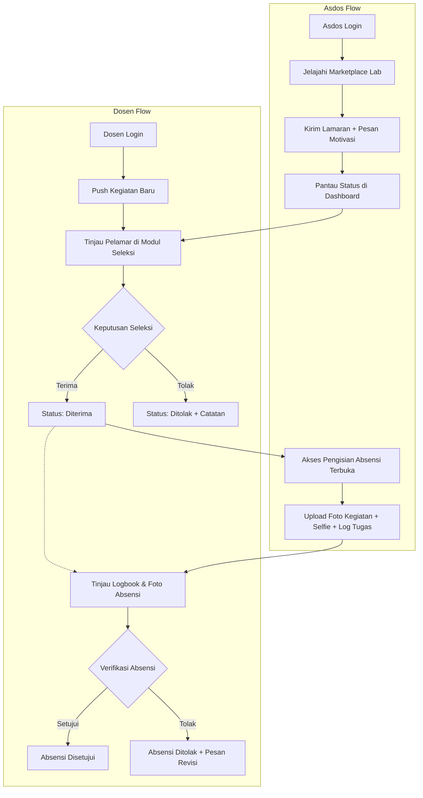
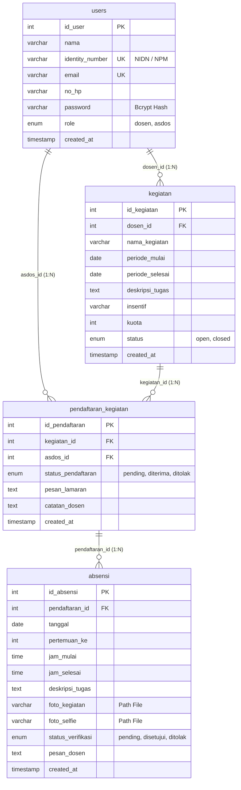

# 🎓 Sistem Marketplace & Absensi Laboratorium Sistem Informasi

<p align="center">
  
  
  
  
  
</p>

Sistem informasi berbasis web yang dibangun menggunakan **PHP Native** dengan pola arsitektur **Model-View-Controller (MVC)**. Platform ini dirancang secara khusus sebagai sistem internal laboratorium jurusan Sistem Informasi untuk memfasilitasi publikasi kegiatan dan praktikum oleh dosen, penyeleksian calon asisten dosen (*marketplace asdos*), serta pelaporan absensi dan verifikasi pelaksanaan tugas asisten secara transparan dan terstruktur.

---

## 📌 Daftar Isi
- [Fitur Utama](#-fitur-utama)
- [Alur Kerja Sistem (Workflow)](#-alur-kerja-sistem-workflow)
- [Arsitektur & Struktur Folder](#-arsitektur--struktur-folder)
- [Peta Rute & Endpoint](#-peta-rute--endpoint)
- [Skema & Relasi Database](#-skema--relasi-database)
- [Stack Teknologi](#-stack-teknologi)
- [Panduan Instalasi & Menjalankan](#-panduan-instalasi--menjalankan)
- [Akun Pengujian (Demo)](#-akun-pengujian-demo)
- [Standar Keamanan](#-standar-keamanan)

---

## 🌟 Fitur Utama

### 1. 🔐 Autentikasi & Keamanan Sesi
* **Multi-Role User:** Mendukung peran **Dosen** dan **Asisten Dosen (Asdos)**.
* **Dual Identitas Login:** Fleksibilitas login menggunakan **NIDN / NPM** atau **Alamat Email**.
* **Keamanan Password:** Enkripsi password satu arah menggunakan algoritma standar industri `password_hash()` (Bcrypt).
* **Role Guard & Middleware:** Proteksi akses rute melalui session guard terpusat (`requireDosen()` dan `requireAsdos()`).

### 2. 👨‍🏫 Panel Dosen
* **Manajemen Profil:** Memperbarui biodata (Nama, NIDN, Email, No. HP) dan fitur ganti password yang terenkripsi.
* **CRUD Kegiatan Lab / Praktikum:** 
  * Membuat kegiatan baru dengan spesifikasi lengkap: judul, periode tanggal, deskripsi tugas, nominal insentif, dan kuota penerimaan.
  * Memperbarui informasi kegiatan dan menghapus kegiatan yang sudah tidak relevan.
  * Pengaturan status kegiatan (*Open / Closed*) secara dinamis.
* **Seleksi Calon Asdos:**
  * Meninjau daftar pelamar asisten dosen untuk setiap kegiatan yang dibuka.
  * Membaca surat/pesan motivasi lamaran dari calon asdos.
  * Memberikan keputusan seleksi (**Diterima** / **Ditolak**) disertai catatan evaluasi langsung ke pelamar.
* **Verifikasi Absensi & Laporan Tugas:**
  * Meninjau antrean pengajuan logbook absensi asdos.
  * Memeriksa bukti pelaksanaan kegiatan (foto dokumentasi kegiatan dan foto selfie kehadiran).
  * Menyetujui atau menolak laporan absensi disertai pesan feedback evaluasi.

### 3. 🧑‍🎓 Panel Asisten Dosen (Asdos)
* **Marketplace Kegiatan Lab:**
  * Menjelajahi seluruh kegiatan/praktikum laboratorium yang sedang berstatus *Open*.
  * Informasi transparan mengenai dosen pengampu, rentang tanggal pelaksanaan, rincian tugas, kuota, dan insentif.
* **Pendaftaran Kegiatan:**
  * Mengajukan lamaran asisten pada kegiatan yang diminati dengan menyertakan pesan motivasi/kualifikasi.
  * Pencegahan pendaftaran ganda pada kegiatan yang sama (*Unique Constraint*).
* **Dashboard & Pelacakan Status:**
  * Memantau status lamaran secara *real-time* (**Menunggu**, **Diterima**, **Ditolak** beserta catatan dari dosen).
  * Melihat ringkasan riwayat tugas dan absensi yang telah disubmit.
* **Form Pelaporan & Absensi Harian:**
  * Mengisi logbook kehadiran (tanggal, pertemuan ke, jam mulai & selesai, dan rincian pekerjaan).
  * Mengunggah dua bukti validasi: **Foto Bukti Kegiatan** dan **Foto Selfie Kehadiran**.
  * Melihat status verifikasi (**Pending**, **Disetujui**, **Ditolak**) dan catatan revisi dari dosen.
* **Manajemen Profil:** Pengaturan biodata pribadi dan pembaruan password akun asdos.

---

## 🔄 Alur Kerja Sistem (Workflow)



---

## 🏗️ Arsitektur & Struktur Folder

Aplikasi menerapkan pola arsitektur **MVC murni (Native MVC)** dengan pemisahan tanggung jawab yang modular dan *clean code*:

```text
absensi_lab/
├── app/
│   ├── Controllers/             # Logika pengendali request & alur aplikasi
│   │   ├── AsdosController.php  # Mengelola marketplace, pendaftaran, dashboard, profil & absensi asdos
│   │   ├── AuthController.php   # Mengelola login (dual ID), registrasi multi-role, dan logout
│   │   └── DosenController.php  # Mengelola profil dosen, CRUD kegiatan, seleksi pelamar & verifikasi absensi
│   ├── Models/                  # Lapisan interaksi database (Data Access Object / PDO)
│   │   ├── Absensi.php          # Query tabel absensi, pencatatan logbook & status verifikasi
│   │   ├── Kegiatan.php         # Query tabel kegiatan, filter marketplace & kuota
│   │   ├── Pendaftaran.php      # Query tabel pendaftaran_kegiatan & status seleksi
│   │   └── User.php             # Query tabel users, autentikasi, profil & update password
│   └── Views/                   # Antarmuka tampilan (UI/HTML dengan Tailwind CSS)
│       ├── Asdos/               # Halaman panel Asisten Dosen
│       │   ├── Absensi.php      # Form pengisian logbook & upload bukti kehadiran
│       │   ├── Daftar.php       # Form konfirmasi pengajuan lamaran kegiatan
│       │   ├── Dashboard.php    # Ringkasan status lamaran & riwayat tugas
│       │   ├── Marketplace.php  # Katalog kegiatan lab yang tersedia
│       │   └── Profil.php       # Form edit profil & ganti password asdos
│       ├── Auth/                # Halaman autentikasi
│       │   ├── Login.php        # Tampilan login dengan opsi NIDN/NPM/Email
│       │   └── Register.php     # Tampilan registrasi multi-role
│       ├── Dosen/               # Halaman panel Dosen
│       │   ├── KegiatanPush.php # Manajemen CRUD kegiatan & kuota
│       │   ├── Profil.php       # Form edit profil & ganti password dosen
│       │   ├── Seleksi.php      # Panel seleksi pelamar kegiatan
│       │   └── Verifikasi.php   # Panel verifikasi logbook absensi & modal foto bukti
│       └── Templates/           # Layout komponen bersama
│           ├── HeaderDosen.php  # Navigasi atas & header panel dosen
│           ├── HeaderAsdos.php  # Navigasi atas & header panel asdos
│           └── Footer.php       # Footer aplikasi
├── core/
│   └── Database.php             # Koneksi PDO dengan implementasi Singleton Pattern
├── public/                      # Public Document Root Web Server
│   ├── assets/                  # Aset statis aplikasi
│   │   ├── css/                 # Custom stylesheet
│   │   ├── js/                  # JavaScript interaktif
│   │   └── uploads/             # Direktori penyimpanan berkas unggahan pengguna
│   │       ├── kegiatan/        # Foto bukti pelaksanaan tugas
│   │       └── selfie/          # Foto selfie kehadiran asdos
│   └── index.php                # Front Controller & Router Utama
├── absensi_lab.sql              # Database dump (DDL Schema & Initial DML Data)
├── context.md                   # Dokumen spesifikasi & histori perencanaan sistem
└── README.md                    # Dokumentasi lengkap proyek
```

---

## 🚦 Peta Rute & Endpoint

Seluruh permintaan HTTP diarahkan melalui satu pintu masuk (**Front Controller**) di [`public/index.php`](file:///c:/laragon/www/absensi_lab/public/index.php) menggunakan parameter query `?page=`:

| Rute / Parameter URL | Hak Akses (Role) | Controller & Method | Deskripsi Fungsi |
| :--- | :--- | :--- | :--- |
| `index.php?page=login` | Publik | `AuthController::showLogin()` / `login()` | Menampilkan form & memproses autentikasi pengguna |
| `index.php?page=register` | Publik | `AuthController::showRegister()` / `register()` | Menampilkan form & memproses registrasi akun baru |
| `index.php?page=logout` | Terautentikasi | `AuthController::logout()` | Menghapus sesi dan keluar dari sistem |
| `index.php?page=dosen/profil` | Dosen | `DosenController::profil()` | Mengelola profil dan password dosen |
| `index.php?page=dosen/kegiatan` | Dosen | `DosenController::kegiatan()` | CRUD publikasi kegiatan lab & pengaturan kuota |
| `index.php?page=dosen/seleksi` | Dosen | `DosenController::seleksi()` | Menyeleksi pelamar asdos (Terima / Tolak + Catatan) |
| `index.php?page=dosen/verifikasi` | Dosen | `DosenController::verifikasi()` | Memeriksa bukti absensi & memberikan persetujuan |
| `index.php?page=asdos/dashboard` | Asdos | `AsdosController::dashboard()` | Melihat ringkasan status lamaran dan riwayat absensi |
| `index.php?page=asdos/marketplace` | Asdos | `AsdosController::marketplace()` | Menjelajahi kegiatan praktikum lab yang aktif |
| `index.php?page=asdos/daftar` | Asdos | `AsdosController::daftar()` | Mengirim lamaran kegiatan lab beserta pesan motivasi |
| `index.php?page=asdos/absensi` | Asdos | `AsdosController::absensi()` | Mengisi laporan logbook & mengunggah foto bukti tugas |
| `index.php?page=asdos/profil` | Asdos | `AsdosController::profil()` | Mengelola profil dan password asdos |

---

## 🗄️ Skema & Relasi Database

Database MySQL `absensi_lab` dirancang dengan integritas relasional penuh (*Foreign Keys* dengan aksi `ON DELETE CASCADE`):



---

## 🛠️ Stack Teknologi

* **Backend Engine:** PHP 8.0+ (Native MVC, OOP, Singleton Pattern)
* **Database Driver:** MySQL / MariaDB via **PDO (PHP Data Objects)**
* **Frontend UI:** HTML5, Tailwind CSS (via CDN), Google Fonts (Inter)
* **Arsitektur:** Model-View-Controller (MVC) murni tanpa framework eksternal
* **Web Server:** Apache / Nginx (Laragon, XAMPP, atau PHP Built-in Server)

---

## 🚀 Panduan Instalasi & Menjalankan

### 1. Prasyarat Sistem
Pastikan perangkat Anda telah terpasang:
* **PHP >= 8.0** dengan ekstensi `pdo_mysql`, `fileinfo`, `mbstring` aktif.
* **MySQL Server >= 8.0** atau **MariaDB**.
* Web server lokal (direkomendasikan menggunakan **Laragon** atau **XAMPP**).

### 2. Kloning / Ekstraksi Repositori
Tempatkan folder proyek pada direktori web server lokal Anda:
* **Laragon:** `C:/laragon/www/absensi_lab`
* **XAMPP:** `C:/xampp/htdocs/absensi_lab`

### 3. Impor Basis Data
1. Buka pengelola database Anda (phpMyAdmin, HeidiSQL, DBeaver, atau MySQL CLI).
2. Buat database baru bernama `absensi_lab`:
   ```sql
   CREATE DATABASE absensi_lab CHARACTER SET utf8mb4 COLLATE utf8mb4_unicode_ci;
   ```
3. Impor file [`absensi_lab.sql`](file:///c:/laragon/www/absensi_lab/absensi_lab.sql) ke dalam database yang baru dibuat.

### 4. Konfigurasi Koneksi Database
Buka file [`core/Database.php`](file:///c:/laragon/www/absensi_lab/core/Database.php) dan sesuaikan kredensial database Anda jika diperlukan:
```php
private string $host     = 'localhost';
private string $dbName   = 'absensi_lab';
private string $user     = 'root';
private string $password = '';
```

### 5. Akses Aplikasi
* **Menggunakan Laragon / Apache Virtual Host:**
  ```text
  http://localhost/absensi_lab/public/index.php
  ```
  *(Atau `http://absensi_lab.test` jika Virtual Host otomatis Laragon aktif)*

* **Menggunakan PHP Built-in Server:**
  Buka terminal pada direktori root proyek (`c:\laragon\www\absensi_lab`), lalu jalankan:
  ```bash
  php -S localhost:8000 -t public
  ```
  Kemudian akses melalui browser di `http://localhost:8000`.

---

## 👥 Akun Pengujian (Demo)

Untuk keperluan pengujian langsung, data awal yang terdapat di database `absensi_lab.sql`:

| Role | Identitas (NIDN / NPM) | Email | Password Default | Keterangan |
| :--- | :--- | :--- | :--- | :--- |
| **Dosen** | `1` | `cozuu101@edumail.edu.rs` | *(Password saat registrasi)* | Akun Dosen Pengampu |
| **Asdos** | `25082010001` | `ola@gmail.com` | *(Password saat registrasi)* | Akun Asisten Dosen |
| **Asdos** | `25082010100` | `WinNoLimitz@gmail.com` | *(Password saat registrasi)* | Akun Asisten Dosen |

> 💡 **Catatan:** Anda juga dapat mendaftarkan akun baru secara langsung melalui menu **Registrasi Akun** pada aplikasi untuk Dosen maupun Asdos.

---

## 🔒 Standar Keamanan

1. **Pencegahan SQL Injection:** Seluruh interaksi database pada lapisan Model memanfaatkan **PDO Prepared Statements** dengan *parameterized binding*.
2. **Pencegahan Cross-Site Scripting (XSS):** Semua data input yang ditampilkan kembali ke browser disanitasi menggunakan `htmlspecialchars()` dengan flag `ENT_QUOTES, 'UTF-8'`.
3. **Penyimpanan Kredensial Aman:** Password disimpan dalam bentuk hash satu arah menggunakan `password_hash($password, PASSWORD_DEFAULT)`.
4. **Validasi & Sanitasi Berkas Unggahan:**
   * Pembatasan jenis ekstensi berkas gambar yang diizinkan (`jpg`, `jpeg`, `png`, `webp`).
   * Validasi ukuran maksimal berkas gambar.
   * Penamaan berkas acak/unik (*unique filename hashing*) saat disimpan ke folder `public/assets/uploads/` untuk mencegah penimpaan (*overwriting*) dan eksekusi file berbahaya.
5. **Otorisasi Sesi (Session Guard):** Setiap controller dan aksi memiliki pengecekan hak akses sesi untuk mencegah akses rute tak berizin (*unauthorized direct URL access*).

---

<p align="center">
  Dibuat dengan ❤️ untuk Laboratorium Sistem Informasi
</p>
